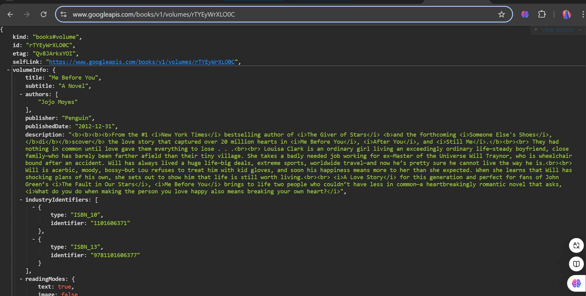

7. Praktikum Menerapkan Plugin di Project Flutter

8. Tugas Praktikum
   1. Selesaikan Praktikum tersebut, lalu dokumentasikan dan push ke repository Anda berupa screenshot hasil pekerjaan beserta penjelasannya di file README.md!
   2. Jelaskan maksud dari langkah 2 pada praktikum tersebut!
        - Jawab : Pada langkah 2, kita diminta untuk menambahkan plugin `auto_size_text` ke proyek dengan perintah `flutter pub add auto_size_text`. Plugin ini membantu teks menyesuaikan ukuran agar tidak terpotong dalam container. Setelah perintah dijalankan, Flutter akan menambahkannya ke file `pubspec.yaml`, sehingga kita bisa menggunakan fiturnya di aplikasi.
   3. Jelaskan maksud dari langkah 5 pada praktikum tersebut!
        - Jawab : Pada langkah 5, variabel `text` dan parameter di constructor ditambahkan ke `RedTextWidget` agar widget ini bisa menerima teks dari luar. Dengan `final String text;` dan constructor `const RedTextWidget({required this.text})`, kita memastikan teks wajib diisi saat membuat widget ini, dan teks tersebut akan ditampilkan oleh `AutoSizeText`.
   4. Pada langkah 6 terdapat dua widget yang ditambahkan, jelaskan fungsi dan perbedaannya!
        - Jawab : 
        - Widget Pertama (Container dengan RedTextWidget): Menampilkan teks merah yang otomatis menyesuaikan ukuran huruf agar tidak terpotong, dengan lebar 50 piksel dan maksimal dua baris.
        - Widget Kedua (Container dengan Text): Menampilkan teks hitam dengan latar hijau, lebar 100 piksel. Tidak bisa menyesuaikan ukuran teks, jadi bisa terpotong jika teks terlalu panjang.
        - Perbedaan utamanya: AutoSizeText di RedTextWidget otomatis menyesuaikan ukuran teks, sedangkan Text tidak.
   5. Jelaskan maksud dari tiap parameter yang ada di dalam plugin auto_size_text berdasarkan tautan pada dokumentasi ini !
        - Jawab : 
        - Plugin `auto_size_text` menyediakan berbagai parameter untuk menyesuaikan tampilan teks agar pas dalam area yang tersedia. Berikut penjelasannya:
            - **text**: Konten utama atau teks yang ingin ditampilkan dalam widget ini.
            - **style**: Menentukan gaya tampilan teks, seperti warna, ukuran awal, dan jenis font.
            - **maxLines**: Jumlah maksimal baris untuk teks. Jika teks melebihi batas ini, ukuran font akan otomatis diperkecil.
            - **minFontSize**: Ukuran font terkecil yang diizinkan, mencegah teks menjadi terlalu kecil saat menyesuaikan.
            - **maxFontSize**: Ukuran font terbesar yang diizinkan, menjaga agar teks tidak terlalu besar ketika ruang berlebih.
            - **overflow**: Menentukan bagaimana teks ditampilkan jika tidak cukup ruang, seperti menambahkan tanda elipsis (`...`).
            - **stepGranularity**: Mengatur tingkat penyesuaian font dalam setiap langkah, sehingga perubahan ukuran lebih halus.
            - **wrapWords**: Jika diatur `true`, teks akan membungkus kata yang panjang; jika `false`, kata panjang tidak akan terputus.
            - Dengan parameter ini, `auto_size_text` dapat menyesuaikan teks agar tetap terlihat jelas dalam area terbatas atau ruang yang luas.
   1. Kumpulkan laporan praktikum Anda berupa link repository GitHub kepada dosen!