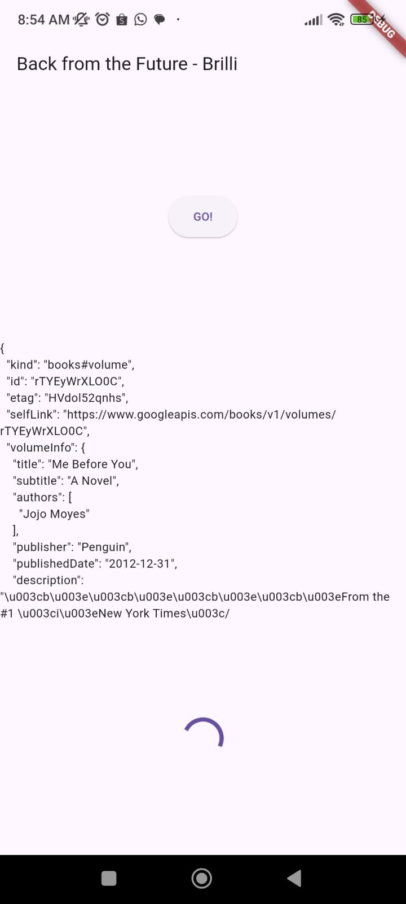
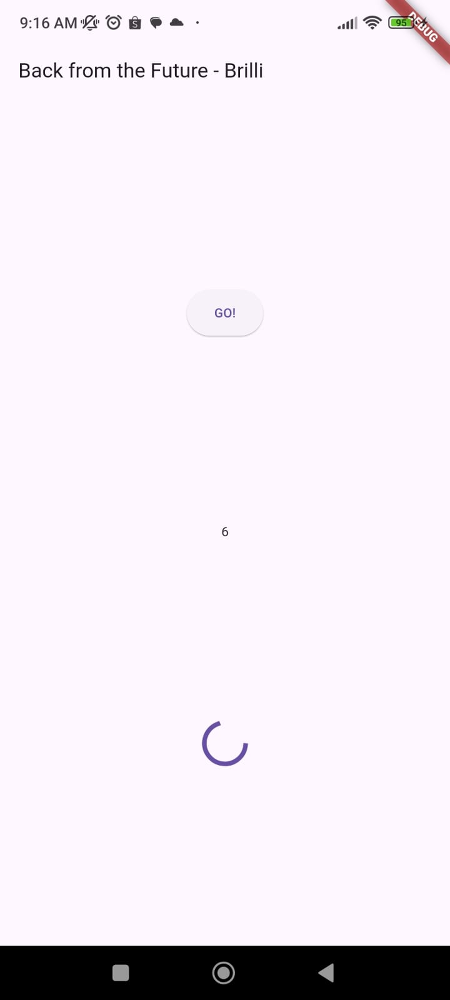
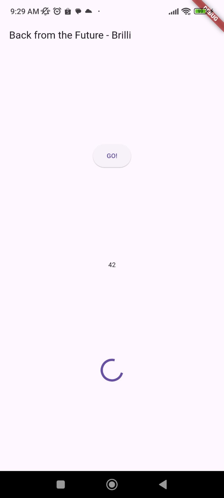
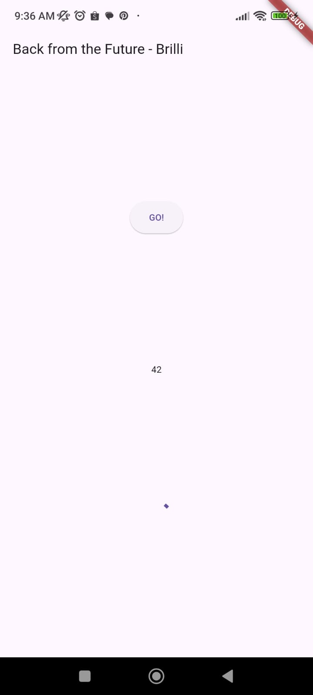
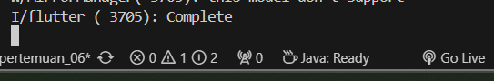
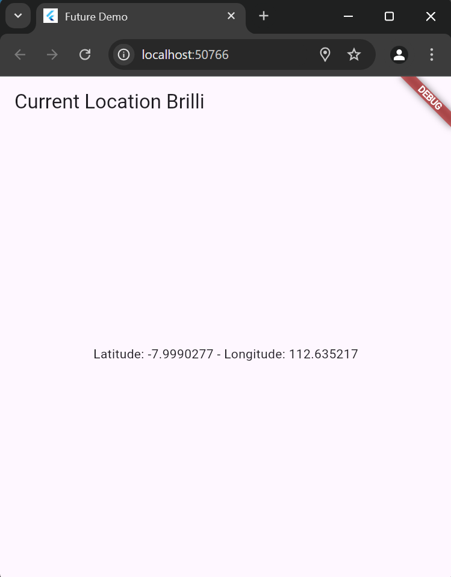

## Nama : Brilliantna Salsabila / 2241720041
## Kelas  : TI-3B

# Praktikum 1: Mengunduh Data dari Web Service (API)
Soal 1
Tambahkan nama panggilan Anda pada title app sebagai identitas hasil pekerjaan Anda.
```
import 'dart:async';
import 'package:flutter/material.dart';
import 'package:http/http.dart' as http;
import 'package:http/http.dart';

void main() {
  runApp(const MyApp());
}

class MyApp extends StatelessWidget {
  const MyApp({super.key});

  @override
  Widget build(BuildContext context) {
    return MaterialApp(
      title: 'Future Demo',
      theme: ThemeData(
        primarySwatch: Colors.blue,
        visualDensity: VisualDensity.adaptivePlatformDensity,
      ),
      home: const FuturePage(),
    );
  }
}

class FuturePage extends StatefulWidget {
  const FuturePage({super.key});

  @override
  State<FuturePage> createState() => FuturePageState();
}

class FuturePageState extends State<FuturePage> {
  String result = '';
  Future<Response> getData() async{
    const authority = 'www.googleapis.com';
    const path = '/books/v1/volumes/junbdwAAQBAJ';
    Uri url = Uri.https(authority, path);
    return http.get(url);
  }

  @override
  Widget build(BuildContext context) {
    return Scaffold(
      appBar: AppBar(
        title: const Text('Back from the Future - Brilli'),
      ),
      body: Center(
        child: Column(
          children: [
            const Spacer(),
            ElevatedButton(
              onPressed: () {},
              child: const Text('G0!'),
            ),
            const Spacer(),
            Text(result),
            const Spacer(),
            const CircularProgressIndicator(),
            const Spacer(),
          ],
        ),
      ),
    );
  }
}

```

Soal 2
  - Carilah judul buku favorit Anda di Google Books, lalu ganti ID buku pada variabel path di kode tersebut. Caranya ambil di URL browser Anda seperti gambar berikut ini.

- Kemudian cobalah akses di browser URI tersebut dengan lengkap seperti ini. Jika menampilkan data JSON, maka Anda telah berhasil. Lakukan capture milik Anda dan tulis di README pada laporan praktikum.


Soal 3 
Jelaskan maksud kode langkah 5 tersebut terkait substring dan catchError!
Di langkah 5 kode itu:

1. **substring(0, 450)**: Bagian ini mengambil sebagian teks dari hasil respons `value.body`. `substring` akan mengambil karakter dari indeks 0 hingga 450 pertama. Tujuannya untuk membatasi teks yang ditampilkan supaya tidak terlalu panjang, hanya sampai 450 karakter.

2. **catchError**: Kalau ada error saat mengambil data (misalnya karena koneksi internet atau respons server bermasalah), `catchError` akan menangkap error tersebut. Lalu, teks `result` akan diisi dengan pesan `'An error occurred'` biar pengguna tahu kalau ada masalah, dan aplikasi nggak crash.

    Jadi, dua bagian ini membantu mengelola hasil respons dengan aman dan memastikan kalaupun ada masalah, aplikasi tetap berjalan dan menampilkan pesan yang jelas.
- Capture hasil praktikum Anda berupa GIF dan lampirkan di README. 


# Praktikum 2: Menggunakan await/async untuk menghindari callbacks
Soal 4
- Jelaskan maksud kode langkah 1 dan 2 tersebut!
Berikut penjelasan singkatnya:

    ### Langkah 1

    Ada tiga fungsi `returnOneAsync`, `returnTwoAsync`, dan `returnThreeAsync`, yang masing-masing menunggu selama 3 detik sebelum mengembalikan nilai (1, 2, atau 3). Ini seperti simulasi proses yang membutuhkan waktu, misalnya mengambil data.

    ### Langkah 2

    Fungsi `count()` menghitung total dari tiga fungsi tadi:
- `total` dimulai dari 0, lalu secara berurutan ditambahkan hasil dari `returnOneAsync`, `returnTwoAsync`, dan `returnThreeAsync`.
- Setiap fungsi dijalankan satu per satu, dan hasil akhirnya adalah 6 (1+2+3).
- Terakhir, `setState()` digunakan untuk memperbarui UI dengan hasil total tersebut.

    Jadi, kode ini menghitung nilai total dari ketiga fungsi yang perlu menunggu masing-masing 3 detik.
- Capture hasil praktikum Anda berupa GIF dan lampirkan di README. 
  

# Praktikum 3: Menggunakan Completer di Future
Soal 5
- Jelaskan maksud kode langkah 2 tersebut!
Tentu, berikut penjelasan yang lebih singkat mengenai kode **Langkah 2**:

    ### 1. **Variabel `late Completer completer;`**
   - `late` menandakan bahwa variabel ini akan diinisialisasi nanti.
   - `Completer<int>` digunakan untuk menyelesaikan operasi asynchronous dan mengembalikan hasil bertipe `int`.

    ### 2. **Method `getNumber()`**
   - Fungsi ini menginisialisasi `completer`, lalu memanggil fungsi `calculate()` untuk melakukan operasi asynchronous.
   - Fungsi ini mengembalikan `completer.future`, yang merupakan objek `Future` yang menunggu hasil dari operasi tersebut.

    ### 3. **Method `calculate()`**
   - Fungsi ini menunggu selama 5 detik menggunakan `Future.delayed()`.
   - Setelah itu, fungsi menyelesaikan operasi dan memberikan hasil `42` menggunakan `completer.complete()`.

    ### Kesimpulan:
  - **`Completer`** digunakan untuk menangani operasi yang membutuhkan waktu, dan menyelesaikan proses dengan hasil yang bisa diambil setelah menunggu beberapa detik.
- Capture hasil praktikum Anda berupa GIF dan lampirkan di README.


Soal 6
- Jelaskan maksud perbedaan kode langkah 2 dengan langkah 5-6 tersebut!
    - Jawab: Perbedaan utama antara **Langkah 2** dan **Langkah 5-6** terletak pada cara penanganan error dan hasil:
        ### Langkah 2:
        - Menggunakan **`then` dan `catchError`** untuk menangani hasil dan error setelah operasi `Future` selesai.
        - Jika terjadi error, `catchError` menangani dan menampilkan pesan error di UI.

        ### Langkah 5-6:
        - **`try-catch`** digunakan di dalam fungsi `calculate()` untuk menangani error langsung saat perhitungan berlangsung, dengan `completeError()` untuk error.
        - Hasil atau error kemudian ditangani di UI menggunakan **`then`** dan **`catchError`** untuk memperbarui UI sesuai hasil atau error.

        ### Inti Perbedaan:
        - **Langkah 5** menangani error lebih awal dalam proses perhitungan, sementara **Langkah 2** menangani error setelah operasi selesai.
        - **Langkah 5** memberi kontrol lebih besar pada tempat error mungkin terjadi, sedangkan **Langkah 2** menangani error setelahnya.
- Capture hasil praktikum Anda berupa GIF dan lampirkan di README. 


# Praktikum 4: Memanggil Future secara paralel
Soal 7
Capture hasil praktikum Anda berupa GIF dan lampirkan di README.
- 

Soal 8
Jelaskan maksud perbedaan kode langkah 1 dan 4!
- Dengan `FutureGroup`, kita bisa menambahkan operasi `Future` kapan saja sebelum memanggil `close()`. Ini memberikan fleksibilitas, terutama kalau kita ingin menambahkan operasi tambahan secara dinamis seiring program berjalan. 
Di sisi lain, `Future.wait` membutuhkan semua daftar `Future` saat dipanggil, jadi lebih cocok kalau kita sudah tahu semua operasi `Future` yang ingin dijalankan sejak awal. Selain itu, `Future.wait` lebih umum digunakan dalam Dart karena lebih sederhana dan tidak memerlukan library tambahan, sehingga sangat cocok untuk kasus-kasus yang straightforward.

# Praktikum 5: Menangani Respon Error pada Async Code
Soal 9
- Capture hasil praktikum Anda berupa GIF dan lampirkan di README.
- 
- 

Soal 10
Panggil method handleError() tersebut di ElevatedButton, lalu run. Apa hasilnya? Jelaskan perbedaan kode langkah 1 dan 4!
- 
- Pada Langkah 1 (returnError), fungsi hanya memicu error setelah penundaan 2 detik, tanpa langsung menangani error tersebut. Error ini harus ditangani di luar fungsi, misalnya dengan .catchError().

Di Langkah 4 (handleError), fungsi langsung menangani error menggunakan try-catch-finally. try mencoba menjalankan fungsi, catch menangkap error dan memperbarui tampilan (setState), dan finally memastikan pesan "Complete" dicetak, terlepas dari keberhasilan atau kegagalan.

Kesimpulan:

Langkah 1 berguna saat ingin membiarkan error ditangani di luar fungsi.
Langkah 4 lebih praktis jika ingin menangani error langsung dalam fungsi, membuat kode lebih ringkas dan mandiri.

# Praktikum 6: Menggunakan Future dengan StatefulWidget
Soal 11
- Tambahkan nama panggilan Anda pada tiap properti title sebagai identitas pekerjaan Anda.

Soal 12
- Apakah Anda mendapatkan koordinat GPS ketika run di browser? Mengapa demikian?

- Ya, saya mendapatkan koordinat GPS ketika menjalankan aplikasi di browser. Hal ini disebabkan oleh plugin Geolocator yang secara otomatis menggunakan HTML5 Geolocation API sebagai fallback ketika aplikasi dijalankan di browser. API ini tidak memerlukan akses langsung ke perangkat keras GPS, melainkan memanfaatkan informasi dari jaringan WiFi, alamat IP, atau data lokasi lainnya yang tersedia di browser.
- Hasil running di perangkat :


# Praktikum 7: Manajemen Future dengan FutureBuilder
Soal 13
- Apakah ada perbedaan UI dengan praktikum sebelumnya? Mengapa demikian?
- 
- Jawan : Ya, ada perbedaan pada UI dibandingkan dengan praktikum sebelumnya. Dalam praktikum ini, kita menggunakan FutureBuilder untuk mengelola data asinkron dan memperbarui UI secara otomatis berdasarkan status future, membuat kode lebih efisien dan terstruktur tanpa perlu pemanggilan manual setState(). Sebelumnya, setState() digunakan untuk memperbarui UI secara manual, memerlukan penanganan perubahan state yang lebih kompleks.
Soal 14
- Apakah ada perbedaan UI dengan langkah sebelumnya? Mengapa demikian?
- 
- Jawab :  Ya, ada perbedaan UI karena penanganan error ditambahkan. Jika terjadi error, UI akan menampilkan pesan kesalahan, memberikan informasi yang lebih jelas dan menghindari tampilan kosong atau error yang tidak tertangani. Sebelumnya, error mungkin tidak ditangani dengan baik dan UI tetap kosong atau menampilkan error yang tidak diinginkan.

# Praktikum 8: Navigation route dengan Future Function
Soal 15
- Tambahkan nama panggilan Anda pada tiap properti title sebagai identitas pekerjaan Anda.
```
class _NavigationFirstState extends State<NavigationFirst> {
    Color color = Colors.blue.shade700;
    @override
    Widget build(BuildContext context) {
        return Scaffold(
            backgroundColor: color,
            appBar: AppBar(
                title: const Text('Navigation First Screen Brilli'),
            ),
            body: Center(
                child: ElevatedButton(
                onPressed: () {
                    _navigateAndGetColor(context);
                },
                child: const Text('Change Color'),
                ),
```
Soal 16
- Cobalah klik setiap button, apa yang terjadi ? Mengapa demikian ?
- Gantilah 3 warna pada langkah 5 dengan warna favorit Anda!
- Jawab : Saat tombol ditekan, aplikasi menavigasi ke layar kedua dan menunggu warna yang dipilih. Setelah memilih warna, aplikasi mengembalikan warna tersebut ke layar pertama dan mengubah latar belakangnya dengan warna yang dipilih menggunakan `setState()`.
Mengapa ? Karena 
- `Navigator.push()` dengan `await` menunggu hasil warna dari layar kedua.
- `setState()` digunakan untuk memperbarui UI layar pertama dengan warna baru.
Langkah-langkah :
Gantilah tiga warna di layar kedua dengan warna favorit Anda (misalnya, `Colors.green`, `Colors.pink`, `Colors.yellow`).


# Praktikum 9: Memanfaatkan async/await dengan Widget Dialog
Soal 17
- Cobalah klik setiap button, apa yang terjadi ? Mengapa demikian ?
- 
- Jawab : Saat tombol diklik, aplikasi akan menampilkan dialog (AlertDialog) yang meminta konfirmasi dari pengguna. Berdasarkan pilihan yang dipilih di dialog, warna latar belakang aplikasi akan berubah sesuai dengan warna yang dipilih.

  Mengapa demikian?

  Tombol akan memicu dialog untuk memilih warna.
  Setelah pengguna memilih warna (misalnya, dengan tombol "Save"), warna yang dipilih dikembalikan menggunakan Navigator.pop().
  Warna yang dipilih kemudian diterapkan pada latar belakang menggunakan setState().
  Langkah-langkah:

  Gantilah tiga warna di dialog dengan warna favorit Anda (misalnya, Colors.orange, Colors.pink, Colors.yellow).
- Gantilah 3 warna pada langkah 3 dengan warna favorit Anda!
- 

