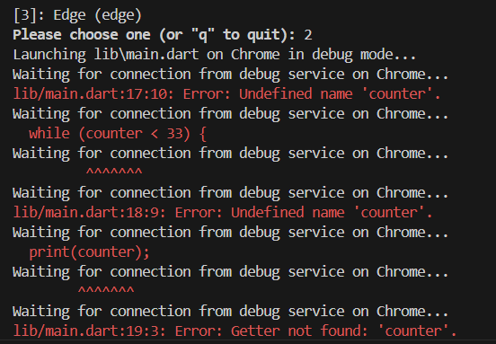

# tgs_praktikum3_brilli

## Nama : Brilliantna Salsabila 
## NIM : 2241720041
## Kelas : D4 TI 3B
## Matkul : Pemrograman Mobile

### Tugas Praktikum 

1. Silakan selesaikan Praktikum 1 sampai 3, lalu dokumentasikan berupa screenshot hasil pekerjaan beserta penjelasannya!

### Praktikum 1: Menerapkan Control Flows ("if/else")
Selesaikan langkah-langkah praktikum berikut ini menggunakan DartPad di browser Anda.

- Langkah 1:
Ketik atau salin kode program berikut ke dalam fungsi main().\
String test = "test2";
if (test == "test1") {
   print("Test1");
} else If (test == "test2") {
   print("Test2");
} Else {
   print("Something else");
}\
if (test == "test2") print("Test2 again");

- Langkah 2:
Silakan coba eksekusi (Run) kode pada langkah 1 tersebut. Apa yang terjadi? Jelaskan!
- Jawab : 

Setelah kode program di jalankan kode memeriksa nilai variabel test. Karena test adalah "test2", kondisi pertama if (test == "test1") tidak terpenuhi, tetapi kondisi else if (test == "test2") terpenuhi, sehingga mencetak "Test2".\
Kemudian, kode memeriksa kondisi kedua if (test == "test2") yang juga benar, sehingga mencetak "Test2 again".

- Langkah 3:
Tambahkan kode program berikut, lalu coba eksekusi (Run) kode Anda.
Apa yang terjadi ? Jika terjadi error, silakan perbaiki namun tetap menggunakan if/else.\
String test = "true";
if (test) {
   print("Kebenaran");
}

- Jawab : \
terjadi error 

perbaikan kode : 

hasil kode program :\
\
Penjelasan : 
Terjadi error dikarenakan
- Variabel test Dideklarasikan Dua Kali:
Variabel test pertama dideklarasikan sebagai String, tetapi kemudian dideklarasikan lagi dengan tipe data yang sama (String) di luar fungsi, yang akan menyebabkan error karena Dart tidak membolehkan deklarasi variabel dengan nama yang sama di scope yang sama.
- Kondisi if (test) Menggunakan Tipe Data String:
Dart tidak mengizinkan perbandingan langsung antara String dan bool. Jadi,  tidak bisa menggunakan if (test) jika test adalah String.
- Lalu untuk memperbaiki kode tersebut maka pada variabel test 1 harus menyimpan nilai string "test2" dan diperiksa dengan kondisi if-else yang sesuai, kemudian untuk variabel test2 Dideklarasikan sebagai bool dengan nilai true, dan digunakan dalam kondisi if yang memeriksa nilai boolean.

###  Praktikum 2: Menerapkan Perulangan "while" dan "do-while"

- Langkah 1\
Ketik atau salin kode program berikut ke dalam fungsi main().\
while (counter < 33) {
  print(counter);
  counter++;
}
- Langkah 2:
Silakan coba eksekusi (Run) kode pada langkah 1 tersebut. Apa yang terjadi? Jelaskan! Lalu perbaiki jika terjadi error.
\
- perbaikan kode serta hasil running program\

\

- Penjelasan 
    - Blok If Pertama (String Comparison):

    - Variabel test1 berisi "test2", sehingga kondisi else if (test1 == "test2") terpenuhi, dan output "Test2" akan dicetak.
    - Selanjutnya, kondisi if (test1 == "test2") juga terpenuhi, sehingga "Test2 again" akan dicetak.
- Blok If Kedua (Boolean):
    - Variabel test2 adalah boolean dengan nilai true, sehingga output "Kebenaran" akan dicetak.
- Loop While:
    - Loop while berjalan selama nilai counter kurang dari 33. Ini berarti akan mencetak nilai counter mulai dari 0 hingga 32.

- Langkah 3:\
Tambahkan kode program berikut, lalu coba eksekusi (Run) kode Anda.
Apa yang terjadi ? Jika terjadi error, silakan perbaiki namun tetap menggunakan do-while.

\
tidak terjadi error, lalu perbedaan antara while dan do while adalah 
while: Mengecek kondisi dulu, baru menjalankan loop.
do-while: Menjalankan loop dulu, baru mengecek kondisi.

### Praktikum 3: Menerapkan Perulangan "for" dan "break-continue"

- Langkah 1:
Ketik atau salin kode program berikut ke dalam fungsi main().

- Langkah 2:
Silakan coba eksekusi (Run) kode pada langkah 1 tersebut. Apa yang terjadi? Jelaskan! Lalu perbaiki jika terjadi error.

- Langkah 3:
Tambahkan kode program berikut di dalam for-loop, lalu coba eksekusi (Run) kode Anda.
\

2. Buatlah sebuah program yang dapat menampilkan bilangan prima dari angka 0 sampai 201 menggunakan Dart. Ketika bilangan prima ditemukan, maka tampilkan nama lengkap dan NIM Anda.
   - 

3. Kumpulkan berupa link commit repo GitHub pada tautan yang telah disediakan di grup Telegram!

