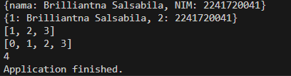
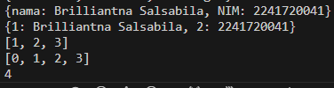
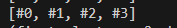

## Laporan Praktikum Mobile JS 4
<table>
<tr>
    <th>Nama</th>
    <td>Brilliantna Salsabila</td>
  </tr>
  <tr>
    <th>NIM</th>
    <td>2241720041</td>
  </tr>
  <tr>
    <th>Kelas/Absen</th>
    <td>3B/04</td>
  </tr>
</table>

# Praktikum 1: Eksperimen Tipe Data List
## Langkah 1
Ketik atau salin kode program berikut ke dalam void main().
```dart
var list = [1, 2, 3];
assert(list.length == 3);
assert(list[1] == 2);
print(list.length);
print(list[1]);
list[1] = 1;
assert(list[1] == 1);
print(list[1]);
```
## Langkah 2
Silakan coba eksekusi (Run) kode pada langkah 1 tersebut. Apa yang terjadi? Jelaskan!

Jawab:

Penjelasan : 
- Kode ini pertama kali membuat sebuah List yang berisi tiga elemen [1, 2, 3].
- assert(list.length == 3); mengecek apakah panjang List sama dengan 3, yang benar.
- assert(list[1] == 2); mengecek apakah elemen pada index ke-1 adalah 2, yang juga benar.
- Kode kemudian menampilkan panjang list (3) dan elemen ke-1 (2).
- Lalu, elemen ke-1 diubah menjadi 1, dan assert(list[1] == 1); mengecek bahwa perubahan tersebut berhasil.
- Kesimpulan : 
Kode menggunakan List untuk menyimpan dan memanipulasi data. Kode tersebut menggunakan assert untuk melakukan pemeriksaan terhadap kondisi tertentu, seperti panjang list dan nilai elemen pada indeks tertentu. Selain itu, kode juga memperlihatkan bahwa elemen dalam list bisa diubah, dan perubahan tersebut dapat dikonfirmasi dengan menggunakan assert. Jadi, tujuan utama kode adalah memverifikasi panjang dan nilai-nilai dalam list sebelum dan setelah perubahan, serta memastikan bahwa operasi modifikasi pada list berhasil dilakukan.
## Langkah 3
Ubah kode pada langkah 1 menjadi variabel final yang mempunyai index = 5 dengan default value = null. Isilah nama dan NIM Anda pada elemen index ke-1 dan ke-2. Lalu print dan capture hasilnya.
Apa yang terjadi ? Jika terjadi error, silakan perbaiki.
- Jawab :
  ```dart
  //praktikum 1 langkah 3
  final List<String?> list2 = List.filled(5, null);
  list2[1] = 'Brilliantna Salsabila';
  list2[2] = '2241720041';
  print(list2);
  ```
  Output : 

 Penjelasan : 
 - final list = List.filled(5, null); – Kode ini membuat sebuah list dengan panjang 5, di mana semua elemennya diinisialisasi dengan nilai null. Karena menggunakan keyword final, ukuran list tidak dapat diubah, tetapi isi dari setiap elemen list masih bisa dimodifikasi.

- list[1] = 'Brilliantna Salsabila'; – Mengubah elemen pada indeks ke-1 dari list menjadi 'Brilliantna Salsabila'.

- list[2] = '2241720041'; – Mengubah elemen pada indeks ke-2 menjadi '2241720041'.

- print(list); – Menampilkan list di terminal dengan output seperti ini:


# Praktikum 2: Eksperimen Tipe Data Set  
## Langkah 1:
Ketik atau salin kode program berikut ke dalam fungsi main().
```dart
var halogens = {'fluorine', 'chlorine', 'bromine', 'iodine', 'astatine'};
print(halogens);
```
## Langkah 2:
Silakan coba eksekusi (Run) kode pada langkah 1 tersebut. Apa yang terjadi? Jelaskan! Lalu perbaiki jika terjadi error.     
Jawab: 

- Penjelasan : 
  Set adalah koleksi yang tidak mengizinkan duplikasi elemen. Di sini, semua elemen ditampilkan dalam urutan acak karena Set tidak menjamin urutan elemen yang dimasukkan.

## Langkah 3:
Tambahkan kode program berikut, lalu coba eksekusi (Run) kode Anda.
```dart
var names1 = <String>{};
Set<String> names2 = {}; // This works, too.
var names3 = {}; // Creates a map, not a set.
print(names1);
print(names2);
print(names3);
```
Apa yang terjadi ?Jika terjadi error, silakan perbaiki namun tetap menggunakan ketiga variabel tersebut. Tambahkan elemen nama dan NIM Anda pada kedua variabel Set tersebut dengan dua fungsi berbeda yaitu .add() dan .addAll(). 
- Jawab:  
names1 dideklarasikan sebagai Set kosong dari tipe String. Ini adalah cara eksplisit untuk membuat set dengan tipe tertentu.

- names2 adalah cara lain untuk mendeklarasikan Set dengan tipe String, dan ini juga valid.

- names3 sebenarnya dideklarasikan sebagai Map karena {} tanpa tipe dianggap sebagai Map oleh Dart, bukan Set.

- Kode kemudian menambahkan elemen ke dalam names1 menggunakan .add() dan ke dalam names2 menggunakan .addAll(), yang menambahkan beberapa elemen sekaligus.

- names3 tidak digunakan dalam langkah ini, karena ia sebenarnya adalah Map. Sesuai instruksi, hapus names3 dari kode.
- penambahkan elemen nama dan NIM :
```dart
//praktikum 2 langkah 3
var names1 = <String>{};  
  Set<String> names2 = {};  
  names1.add('Brilliantna Salsabila');     
  names1.addAll(['2241720041']); 
  names2.add('Brilliantna');      
  names2.addAll(['2241720041']); 
  var names3 = <String, String>{}; 
  print(names1);  
  print(names2);  
  print(names3);  
```
- output : 
 

# Praktikum 3: Eksperimen Tipe Data Maps
## Langkah 1:
Ketik atau salin kode program berikut ke dalam fungsi main().
```dart
var gifts = {
  // Key:    Value
  'first': 'partridge',
  'second': 'turtledoves',
  'fifth': 1
};
var nobleGases = {
  2: 'helium',
  10: 'neon',
  18: 2,
};
print(gifts);
print(nobleGases);
```
## Langkah 2:
Silakan coba eksekusi (Run) kode pada langkah 1 tersebut. Apa yang terjadi? Jelaskan! Lalu perbaiki jika terjadi error.
Jawab:

- Penjelasan : Pada langkah ini, kode menggunakan Map di Dart untuk menyimpan pasangan key-value. Tidak seharusnya ada error, tetapi jika ada kesalahan, kemungkinan penyebabnya adalah masalah dengan tipe data pada salah satu value di Maps. Contoh pada variable gifts, semua value bertipe String, kecuali 'fifth' yang bertipe int. Sedangkan pada nobleGases, tipe data key semuanya int, tetapi value bervariasi antara String dan int.
## Langkah 3:
Tambahkan kode program berikut, lalu coba eksekusi (Run) kode Anda.
```dart
var mhs1 = Map<String, String>();
gifts['first'] = 'partridge';
gifts['second'] = 'turtledoves';
gifts['fifth'] = 'golden rings';
var mhs2 = Map<int, String>();
nobleGases[2] = 'helium';
nobleGases[10] = 'neon';
nobleGases[18] = 'argon';
```
Apa yang terjadi ? Jika terjadi error, silakan perbaiki.Tambahkan elemen nama dan NIM Anda pada tiap variabel di atas (gifts, nobleGases, mhs1, dan mhs2).
- Jawab: 
 
- Penjelasan: 
- Map<String, String> digunakan untuk mendefinisikan peta yang berisi key dan value yang harus berupa String.
- gifts['fifth'] yang tadinya integer, sekarang diganti menjadi 'golden rings' agar sesuai dengan tipe data Map<String, String>.
- Pada mhs1 dan mhs2, kamu diminta menambahkan elemen berupa nama dan NIM ke dalam Map yang sudah ada.
# Praktikum 4: Eksperimen Tipe Data List: Spread dan Control-flow Operators
## Langkah 1:
Ketik atau salin kode program berikut ke dalam fungsi main().
```dart
var list = [1, 2, 3];
var list2 = [0, ...list];
print(list1);
print(list2);
print(list2.length);
```
## Langkah 2:
Silakan coba eksekusi (Run) kode pada langkah 1 tersebut. Apa yang terjadi? Jelaskan! Lalu perbaiki jika terjadi error.
- Jawab: 
- penjelasan : Error yang dialami terjadi karena mendeklarasikan variabel list2 dua kali di scope yang sama. Di satu tempat, sudah mendefinisikan list2 sebagai List<String?>, dan di tempat lain,  mendefinisikannya kembali sebagai list numerik [0, ...list], sehingga menyebabkan konflik.
- Pembetulan 
```dart
//praktikum 4 langkah 1
var list = [1, 2, 3];
var list3 = [0, ...list]; // Ganti nama list2 jadi list3
print(list);
print(list3);
print(list3.length);
```  


## Langkah 3:
Tambahkan kode program berikut, lalu coba eksekusi (Run) kode Anda.
```dart
list1 = [1, 2, null];
print(list1);
var list3 = [0, ...?list1];
print(list3.length);
```
Apa yang terjadi ? Jika terjadi error, silakan perbaiki. Tambahkan variabel list berisi NIM Anda menggunakan Spread Operators. 
Jawab:    

Penjelasan : Error pada kode yang kamu tulis kemungkinan terjadi karena ada beberapa masalah sintaks atau implementasi yang tidak benar pada kode Dart. Namun, secara umum, kode berikut seharusnya berfungsi dengan baik.

- Pembetulan: 
```dart
//praktikum 4 langkah 3
 void main() {
  var list1 = [1, 2, null]; // List dengan elemen null
  print(list1);             // Cetak list1

  var list3 = [0, ...?list1]; // Spread operator dengan null-aware
  print(list3);               // Cetak list3
  print(list3.length);        // Cetak panjang dari list3
}
```

- Penjelasan : 
list1 adalah list dengan elemen 1, 2, dan null.
list3 adalah list baru yang terdiri dari elemen 0 dan elemen-elemen dari list1. Operator spread ...? digunakan di sini untuk menangani nilai null. Jika list1 bernilai null, maka tidak akan ditambahkan ke list3, tetapi jika ada nilainya (termasuk nilai null di dalamnya), maka tetap akan ditambahkan.
print(list3.length) akan mencetak panjang dari list3.

## Langkah 4:
Tambahkan kode program berikut, lalu coba eksekusi (Run) kode Anda.
```dart
var nav = ['Home', 'Furniture', 'Plants', if (promoActive) 'Outlet'];
print(nav);
```
Apa yang terjadi ? Jika terjadi error, silakan perbaiki. Tunjukkan hasilnya jika variabel promoActive ketika true dan false.
Jawab :

- Penjelasan : Program mencoba menggunakan variabel promoActive, namun variabel tersebut tidak ada di mana pun di dalam kode. Oleh karena itu, Dart memberikan error "Undefined name 'promoActive'" karena ia tidak mengenali variabel tersebut.
- Pembetulan : 

- Penjelasan : Jika promoActive bernilai true, maka 'Outlet' akan ditambahkan ke list nav.
Jika false, maka 'Outlet' tidak akan ditambahkan.

## Langkah 5:
Tambahkan kode program berikut, lalu coba eksekusi (Run) kode Anda.
```dart
var nav2 = ['Home', 'Furniture', 'Plants', if (login case 'Manager') 'Inventory'];
print(nav2);
```
Apa yang terjadi ? Jika terjadi error, silakan perbaiki. Tunjukkan hasilnya jika variabel login mempunyai kondisi lain.
- Jawab : 

- penjelasan : Kode yang diberikan memiliki masalah sintaksis karena Dart tidak memiliki fitur case yang langsung digunakan di dalam list. Dart menggunakan switch-case atau kondisional lain seperti if-else untuk mengecek nilai variabel.
  
- Pembetulan : 
- penjelasan :
  Kode menggunakan if (login == 'Manager') untuk memeriksa apakah pengguna login sebagai "Manager". Jika benar, elemen 'Inventory' ditambahkan ke dalam list nav2.
## Langkah 6:
Tambahkan kode program berikut, lalu coba eksekusi (Run) kode Anda.
```dart
var listOfInts = [1, 2, 3];
var listOfStrings = ['#0', for (var i in listOfInts) '#$i'];
assert(listOfStrings[1] == '#1');
print(listOfStrings);
```
Apa yang terjadi ? Jika terjadi error, silakan perbaiki. Jelaskan manfaat Collection For dan dokumentasikan hasilnya.
Jawab 

- penjelasan : listOfInts adalah list berisi angka 1, 2, 3.

- listOfStrings adalah list baru yang dibuat menggunakan for. Untuk setiap elemen i dalam listOfInts, string '#$i' akan ditambahkan ke listOfStrings. Ini menggunakan interpolasi string untuk menggabungkan angka ke dalam string.

- Hasil dari for ini adalah menambahkan '#1', '#2', dan '#3' ke dalam listOfStrings.
Elemen pertama adalah '#0' yang didefinisikan secara langsung.
assert(listOfStrings[1] == '#1') mengecek apakah elemen pertama dari hasil iterasi adalah '#1'. Jika tidak, program akan memunculkan error.

print(listOfStrings) akan mencetak list hasilnya.

# Praktikum 5: Eksperimen Tipe Data Records
## Langkah 1:
Ketik atau salin kode program berikut ke dalam fungsi main().
```dart
var record = ('first', a: 2, b: true, 'last');
print(record)
```
## Langkah 2:
Silakan coba eksekusi (Run) kode pada langkah 1 tersebut. Apa yang terjadi? Jelaskan! Lalu perbaiki jika terjadi error.
Jawab: 

## Langkah 3:
Tambahkan kode program berikut, lalu coba eksekusi (Run) kode Anda.
```dart
(int, int) tukar((int, int) record) {
  var (a, b) = record;
  return (b, a);
}
```
Apa yang terjadi ? Jika terjadi error, silakan perbaiki. Gunakan fungsi tukar() di dalam main() sehingga tampak jelas proses pertukaran value field di dalam Records.
Jawab:   


## Langkah 4:
Tambahkan kode program berikut, lalu coba eksekusi (Run) kode Anda.
```dart
(String, int) mahasiswa;
print(mahasiswa);
```
Apa yang terjadi ? Jika terjadi error, silakan perbaiki. Inisialisasi field nama dan NIM Anda pada variabel record mahasiswa di atas. 
Jawab : 

## Langkah 5:
Tambahkan kode program berikut, lalu coba eksekusi (Run) kode Anda.
```dart
var mahasiswa2 = ('first', a: 2, b: true, 'last');
print(mahasiswa2.$1); // Prints 'first'
print(mahasiswa2.a); // Prints 2
print(mahasiswa2.b); // Prints true
print(mahasiswa2.$2); // Prints 'last'
```
Apa yang terjadi ? Jika terjadi error, silakan perbaiki. Gantilah salah satu isi record dengan nama dan NIM Anda,
Jawab : 


# 7. Tugas Praktikum
1. Silakan selesaikan Praktikum 1 sampai 5, lalu dokumentasikan berupa screenshot hasil pekerjaan Anda beserta penjelasannya!
2. Jelaskan yang dimaksud Functions dalam bahasa Dart!
Jawab : Functions adalah blok kode yang dapat dijalankan kapan saja dan dapat menerima input, mengembalikan output, atau hanya menjalankan perintah. Dart mendukung fungsi dengan tipe dan fungsi tanpa tipe. Functions juga dapat dideklarasikan di dalam kelas sebagai method atau di luar sebagai fungsi global.
Contoh : 
```dart
// Function tanpa return type yang mencetak Hello
void sayHello() {
  print('Hello, World!');
}

// Function dengan return type
int add(int a, int b) {
  return a + b;
}

``` 
3. Jelaskan jenis-jenis parameter di Functions beserta contoh sintaksnya!
Jawab : 
- Dart mendukung beberapa jenis parameter yang dapat digunakan dalam function:
    - Positional Parameters: Parameter yang harus diisi dalam urutan tertentu.
    - Named Parameters: Parameter yang dapat diberi nama ketika dipanggil, dan dapat bersifat opsional.
    - Default Parameters: Parameter yang memiliki nilai default, jika tidak diberikan saat pemanggilan.
    - Optional Positional Parameters: Parameter yang opsional dan ditandai dengan [].
    - Contoh : 
```dart
  // Positional Parameters
int multiply(int a, int b) {
  return a * b;
}

// Named Parameters
void greet({String name = 'Guest', int age = 18}) {
  print('Hello $name, Age: $age');
}

// Optional Positional Parameters
String formatString(String str, [int repeatCount = 1]) {
  return str * repeatCount;
}
```
4. Jelaskan maksud Functions sebagai first-class objects beserta contoh sintaknya!
Jawab : 
- Dalam Dart, functions dianggap sebagai first-class objects yang berarti:
    - Functions dapat disimpan dalam variabel.
    - Functions dapat dikirim sebagai argumen ke function lain.
    - Functions dapat dikembalikan dari function lain.
    - Contoh
```dart
// Menyimpan function ke variabel
var sayHello = () => print('Hello');

// Menggunakan function sebagai parameter
void doSomething(Function action) {
  action();
}

// Function yang mengembalikan function
Function createAdder(int number) {
  return (int value) => number + value;
}

void main() {
  sayHello(); // Memanggil function dari variabel

  doSomething(sayHello); // Mengirim function sebagai argumen

  var addFive = createAdder(5);
  print(addFive(10)); // Output: 15
}

``` 
5. Apa itu Anonymous Functions? Jelaskan dan berikan contohnya!
   - Jawab : Anonymous functions (fungsi anonim) adalah function yang tidak memiliki nama. Mereka sering digunakan sebagai argumen untuk function lain atau ketika fungsi hanya digunakan sekali.
   - Contoh : 
```dart
// Anonymous function sebagai argumen
var numbers = [1, 2, 3];
numbers.forEach((number) {
  print('Number: $number');
});

// Anonymous function disimpan dalam variabel
var multiply = (int a, int b) => a * b;

void main() {
  print(multiply(3, 4)); // Output: 12
}

```
6. Jelaskan perbedaan Lexical scope dan Lexical closures! Berikan contohnya!
   - Jawab : Lexical Scope adalah konsep di mana variabel hanya bisa diakses dalam area di mana ia dideklarasikan.

Lexical Closure adalah fungsi yang "menutup" variabel dari scope di luar dirinya. Closure dapat "mengingat" lingkungan di mana ia didefinisikan, bahkan setelah scope tersebut berakhir.
 - Contoh: 
 - Lexical Scope:
```dart
void outerFunction() {
  var outerVar = 'Outer';

  void innerFunction() {
    print(outerVar); // Mengakses variabel luar
  }

  innerFunction();
}

void main() {
  outerFunction(); // Output: Outer
}

```
- Contoh Lexical Closure
```dart
Function createCounter() {
  int count = 0;

  return () {
    count++;
    return count;
  };
}

void main() {
  var counter = createCounter();
  
  print(counter()); // Output: 1
  print(counter()); // Output: 2
}

``` 
7. Jelaskan dengan contoh cara membuat return multiple value di Functions!
- Jawab : Dart tidak secara langsung mendukung return multiple values seperti di beberapa bahasa lain. Namun, kita dapat mengembalikan List, Map, atau menggunakan class untuk mengembalikan beberapa nilai.
- Contoh List : 
```dart
List<int> getCoordinates() {
  return [10, 20];
}

void main() {
  var coordinates = getCoordinates();
  print('X: ${coordinates[0]}, Y: ${coordinates[1]}');
}

```
- Contoh Map : 
```dart
Map<String, int> getCoordinates() {
  return {'x': 10, 'y': 20};
}

void main() {
  var coordinates = getCoordinates();
  print('X: ${coordinates['x']}, Y: ${coordinates['y']}');
}

```
- Contoh Class : 
```dart
class Coordinates {
  final int x, y;
  Coordinates(this.x, this.y);
}

Coordinates getCoordinates() {
  return Coordinates(10, 20);
}

void main() {
  var coordinates = getCoordinates();
  print('X: ${coordinates.x}, Y: ${coordinates.y}');
}

```