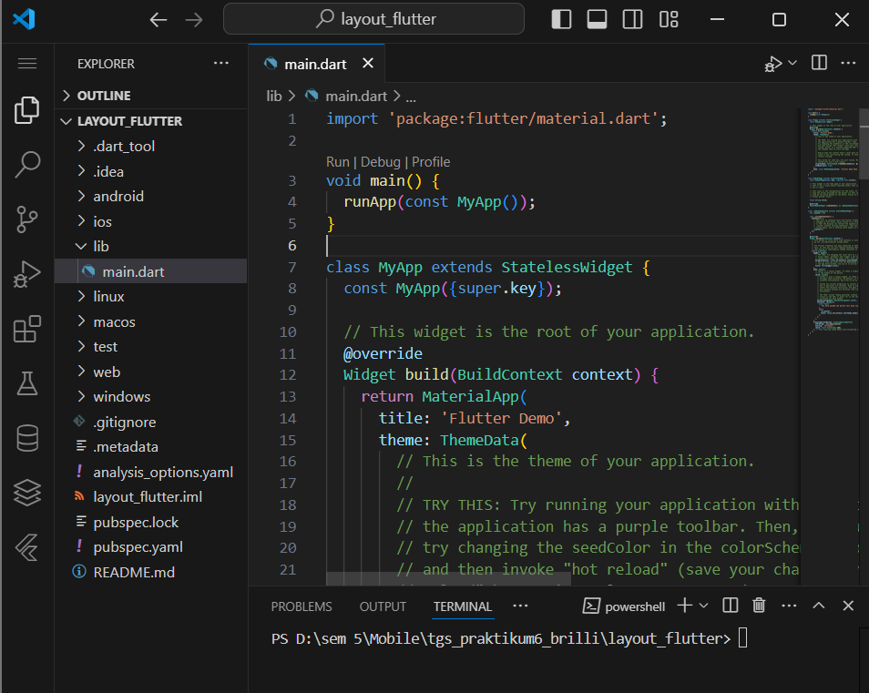
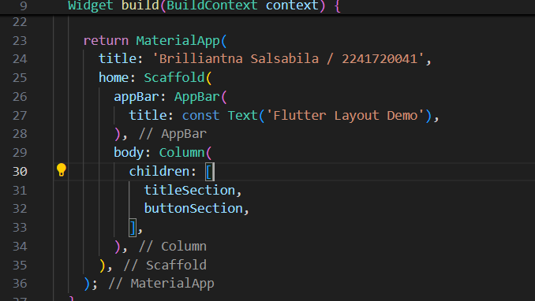
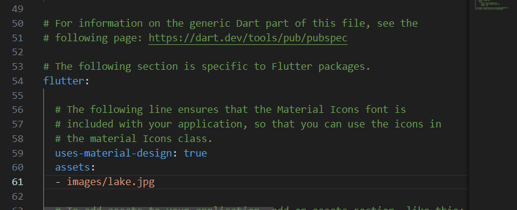
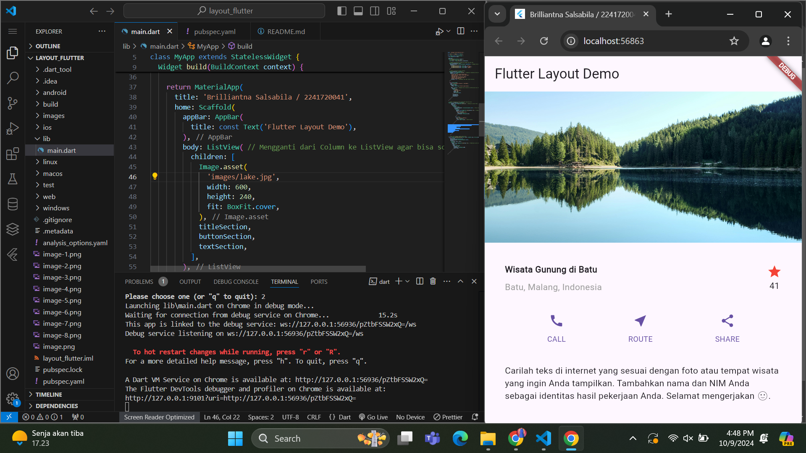
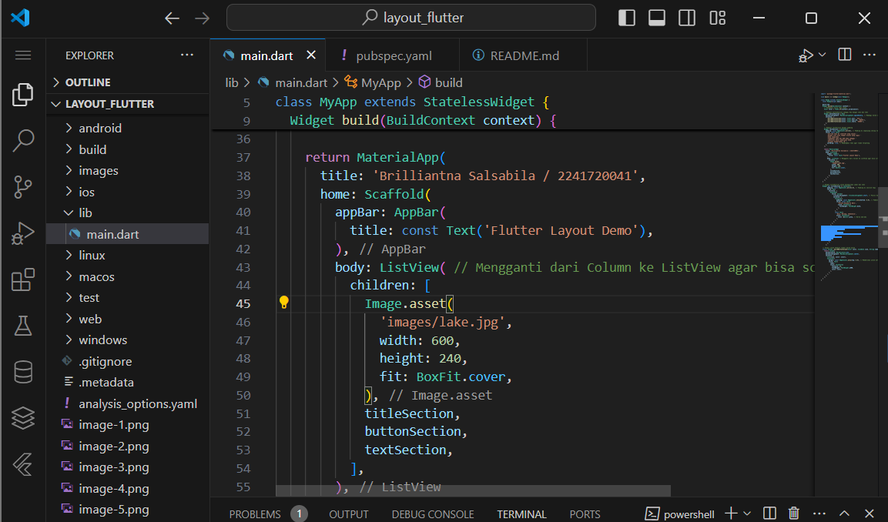
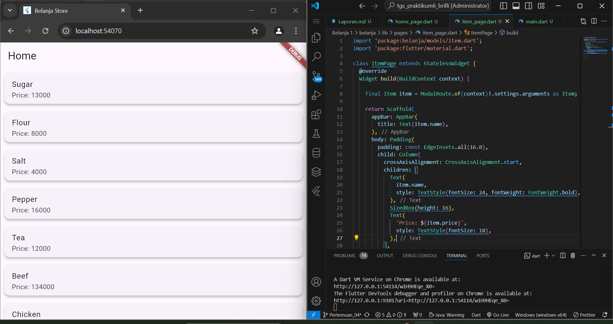

## Praktikum 1
### Langkah 1 

### langkah 2

### Langkah 4


## Praktikum 2
### Langkah 1

### Langkah 2

### Langkah 3


## Praktikum 3
### Langkah 1 

### Langkah 2


## Praktikum 4
### Langkah 1 

### Langkah 2

### Langkah 3 


## Tugas Praktikum 1
- Material Apps 

- Cupertino Apps
 
- Non-Material apps

### Layout multiple widgets vertically and horizontally
- Aligning widgets: Row
 
- Aligning widgets: Column
  
- Sizing widgets
  
  
- Packing widgets

- Nesting rows and columns
  
  
- Common layout widgets
-  Container 
  
- GridView
  
- ListView
  
- Stack
  
- Card
  

## Praktikum 5
### Langkah 1 


### Langkah 2


### Langkah 3

### Langkah 4

### Langkah 5

### langkah 6

### Langkah 7 



## Tugas Praktikum 2
2. Pembacaan nilai yang dikirimkan pada halaman sebelumnya dapat dilakukan menggunakan ModalRoute. Tambahkan kode berikut pada blok fungsi build dalam halaman ItemPage. Setelah nilai didapatkan, anda dapat menggunakannya seperti penggunaan variabel pada umumnya.

3. Pada hasil akhir dari aplikasi belanja yang telah anda selesaikan, tambahkan atribut foto produk, stok, dan rating. Ubahlah tampilan menjadi GridView seperti di aplikasi marketplace pada umumnya.


4. Silakan implementasikan Hero widget pada aplikasi belanja Anda dengan mempelajari dari sumber ini: https://docs.flutter.dev/cookbook/navigation/hero-animations
```
 child: Card(
              child: Column(
                children: [
                  Hero(
                    tag: 'hero-${items[index].name}', // Unique tag for Hero
                    child: Container(
                      height: 100, // Fixed height for the image
                      width: double.infinity,
                      child: Image.asset(
                        items[index].imageUrl, // Asset path
                        fit: BoxFit.cover,
                      ),
                    ),
                  ),
```
5. Sesuaikan dan modifikasi tampilan sehingga menjadi aplikasi yang menarik. Selain itu, pecah widget menjadi kode yang lebih kecil. Tambahkan Nama dan NIM di footer aplikasi belanja Anda.
   - 
6. Selesaikan Praktikum 5: Navigasi dan Rute tersebut. Cobalah modifikasi menggunakan plugin go_router, lalu dokumentasikan dan push ke repository Anda berupa screenshot setiap hasil pekerjaan beserta penjelasannya di file README.md. Kumpulkan link commit repository GitHub Anda kepada dosen yang telah disepakati!
```
void main() {
  runApp(MyApp());
}

class MyApp extends StatelessWidget {
  final GoRouter _router = GoRouter(
    routes: [
      GoRoute(
        path: '/',
        builder: (context, state) => HomePage(),
      ),
      GoRoute(
        path: '/item/:itemName',
        builder: (context, state) {
          final itemName = state.pathParameters['itemName']!;
          // Temukan item berdasarkan nama
          final item = items.firstWhere((item) => item.name == itemName);
          return ItemDetailPage(item: item);
        },
      ),
    ],
  );
```
