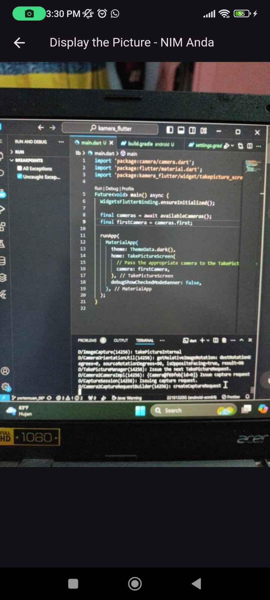
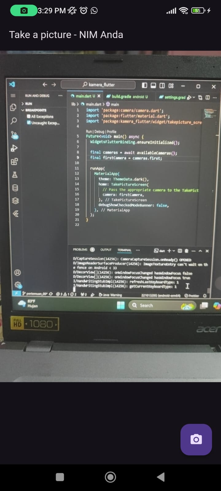

## Nama : Brilliantna Salsabila A
## Kelas : TI-3B
## NIM  : 2241720041

## Tugas Praktikum
1. Selesaikan Praktikum 1 dan 2, lalu dokumentasikan dan push ke repository Anda berupa screenshot setiap hasil pekerjaan beserta penjelasannya di file README.md! Jika terdapat error atau kode yang tidak dapat berjalan, silakan Anda perbaiki sesuai tujuan aplikasi dibuat!
- Praktikum 1 : 



- Praktikum 2 : 

2. Gabungkan hasil praktikum 1 dengan hasil praktikum 2 sehingga setelah melakukan pengambilan foto, dapat dibuat filter carouselnya!
- 
3. Jelaskan maksud void async pada praktikum 1?
- jawab : void async menunjukkan bahwa fungsi tersebut bersifat asinkron (tidak langsung selesai) dan tidak mengembalikan nilai (menggunakan void). Fungsi ini memungkinkan menjalankan tugas yang memerlukan waktu, seperti mengambil data dari internet, tanpa menghambat aplikasi.
- contoh : 
```
Future<void> fetchData() async {
  var data = await getDataFromAPI();
  print(data);
}

```
4. Jelaskan fungsi dari anotasi @immutable dan @override ?
- Jawab : @immutable: Menandakan bahwa objek dalam kelas tidak boleh diubah setelah dibuat. Semua properti harus bersifat final.
- contoh : 
```
@immutable
class Point {
  final int x, y;
  Point(this.x, this.y);
}
```
- @override: Digunakan untuk menunjukkan bahwa metode di kelas anak menggantikan metode dari kelas induk. Menandakan penggantian metode secara eksplisit.
- contoh : 
```
class Dog extends Animal {
  @override
  void speak() {
    print("Dog barks");
  }
}
```
